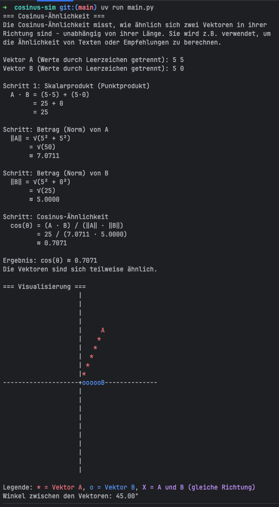

# Cosinus-Ähnlichkeit – Lernprojekt

Ein kleines Python-Kommandozeilen-Projekt, um die
Berechnung der **Cosinus-Ähnlichkeit** zweier Vektoren Schritt für Schritt
nachzuvollziehen.

## Worum geht es?

Die Cosinus-Ähnlichkeit misst, wie ähnlich sich zwei Vektoren in ihrer
Richtung sind – unabhängig von ihrer Länge. Sie wird z.B. verwendet, um die
Ähnlichkeit von Texten (als Wortvektoren) oder in Empfehlungssystemen zu
berechnen.

Das Programm fragt zwei Vektoren ab, zeigt dann jeden Rechenschritt einzeln
an (Skalarprodukt, Betrag/Normalisierung, Einsetzen in die Formel) und gibt
am Ende das Ergebnis mit einer kurzen Einordnung aus. Sind beide Vektoren
2-dimensional, wird zusätzlich eine ASCII-Visualisierung im Terminal
angezeigt: Vektor A erscheint rot, Vektor B blau, und ein magenta "X"
markiert, wenn beide Vektoren in dieselbe Richtung zeigen.

## Voraussetzungen

- Python 3.12 oder neuer
- [uv](https://docs.astral.sh/uv/) – verwaltet die Abhängigkeiten und die
  passende virtuelle Umgebung automatisch. `uv run ...` installiert bei
  Bedarf selbstständig alles Nötige in eine projekteigene Umgebung; eine
  manuelle Aktivierung eines venv ist nicht nötig.
- Die Rechenlogik selbst (`vector_math.py`) braucht keine externen Pakete

## Ausführen

```bash
uv run main.py
```

Beispiel:



## Tests ausführen

```bash
uv run pytest tests/ -v
```

## Projektstruktur

- `main.py` – Kommandozeilen-Ablauf (Eingabe, Ausgabe der Rechenschritte)
- `vector_math.py` – reine Rechenfunktionen (Skalarprodukt, Betrag,
  Cosinus-Ähnlichkeit, Winkel)
- `visualisierung.py` – ASCII-Koordinatenraster für 2D-Vektoren
- `tests/` – Pytest-Tests für `vector_math.py` und `visualisierung.py`
